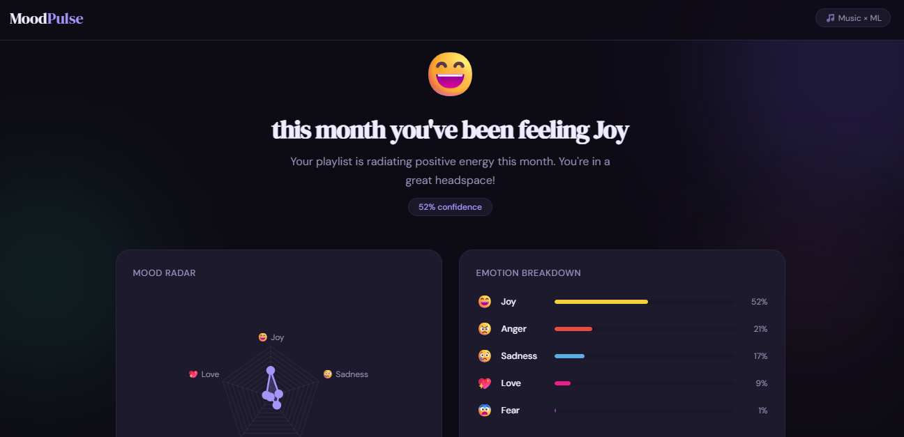
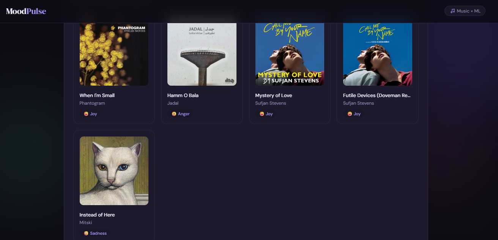

# 🎵 MoodPulse — Your Music, Your Mood ?

> An end-to-end ML project that connects to your Spotify account, analyzes your top tracks using a fine-tuned DistilBERT model, and predicts your current emotional state with a beautiful radar chart visualization.



---

## ✨ What it does

1. **Connect Spotify** — OAuth 2.0 login, fetches your real top tracks
2. **Choose your period** — Last month / Last 6 months / All time
3. **AI analyzes lyrics** — Fine-tuned DistilBERT classifies emotions from lyrics
4. **Audio fusion** — Spotify audio features (valence, energy, danceability) are fused with lyrics emotions
5. **Mood report** — Beautiful radar chart + per-song breakdown

---

## 🧠 ML Model

- **Base model:** `distilbert-base-uncased`
- **Dataset:** [GoEmotions](https://huggingface.co/datasets/go_emotions) (58k labeled samples)
- **Labels:** Joy 😄 · Sadness 😢 · Anger 😠 · Fear 😨 · Love 💖
- **Accuracy:** ~76% on test set
- **Hosted on:** [huggingface.co/reiiham/moodpulse-emotion](https://huggingface.co/reiiham/moodpulse-emotion)

### Fine-tuning details

| Parameter | Value |
|-----------|-------|
| Epochs | 4 (early stopping) |
| Batch size | 32 |
| Learning rate | 2e-5 (cosine scheduler) |
| Max sequence length | 128 tokens |
| Hardware | Google Colab T4 GPU |
| Training time | ~30 minutes |

---

## 🏗️ Architecture

```
Frontend (HTML/JS)
      ↓ Spotify OAuth
Spring Boot Gateway (Java 17)
      ↓ REST
FastAPI Inference Server (Python)
      ↓ HuggingFace Hub
Fine-tuned DistilBERT
      +
Spotify Audio Features API
      ↓ Fusion (70% lyrics / 30% audio)
Mood Prediction + Radar Chart
```

---

## 🛠️ Tech Stack

| Layer | Technology |
|-------|-----------|
| ML Model | Python · PyTorch · HuggingFace Transformers |
| Inference API | FastAPI · Uvicorn |
| Gateway | Java 17 · Spring Boot 3 · WebFlux |
| Frontend | HTML · CSS · JavaScript · Chart.js |
| Auth | Spotify OAuth 2.0 |
| Lyrics | Genius API |
| Model hosting | HuggingFace Hub |
| Deployment | HuggingFace Spaces · Railway · Vercel |

---

## 📁 Project Structure

```
MoodPulse/
├── moodpulse-api/               # FastAPI inference server
│   ├── app/
│   │   ├── main.py              # Routes: /predict /health
│   │   ├── model.py             # DistilBERT emotion classifier
│   │   ├── spotify.py           # Spotify audio features fetcher
│   │   ├── lyrics.py            # Genius lyrics scraper
│   │   └── fusion.py            # Lyrics + audio feature fusion
│   ├── requirements.txt
│   ├── Dockerfile
│   └── .env
│
├── moodpulse-gateway/           # Spring Boot gateway
│   └── src/main/java/ma/reihaam/moodpulsegateway/
│       ├── controller/
│       │   ├── MoodController.java
│       │   └── SpotifyAuthController.java
│       ├── service/
│       │   ├── MoodService.java
│       │   ├── SpotifyAuthService.java
│       │   └── SpotifyService.java
│       ├── model/
│       │   └── Models.java
│       └── config/
│           └── WebConfig.java
│
├── moodpulse-frontend/          # Frontend
│   └── index.html
│
└── MoodPulse_FineTuning.ipynb   # Google Colab fine-tuning notebook
```

---

## 🚀 Running locally

### Prerequisites

- Python 3.11+
- Java 17+
- Maven
- Spotify Developer account
- Genius API account

### 1. FastAPI server

```bash
cd moodpulse-api
python -m venv venv
venv\Scripts\activate        # Windows
source venv/bin/activate     # Mac/Linux

pip install -r requirements.txt

# Create .env file
cp .env.example .env
# Add your GENIUS_TOKEN to .env

uvicorn app.main:app --reload --port 7860
# → http://localhost:7860/docs
```

### 2. Spring Boot gateway

Set environment variables:

```bash
SPOTIFY_CLIENT_ID=your_client_id
SPOTIFY_CLIENT_SECRET=your_client_secret
MOODPULSE_API_URL=http://localhost:7860
CORS_ORIGINS=http://127.0.0.1:5500,http://localhost:5500
```

```bash
cd moodpulse-gateway
mvn spring-boot:run
# → http://localhost:8080/docs
```

### 3. Frontend

Open `moodpulse-frontend/index.html` with Live Server (VSCode) on port 5500.

Or:
```bash
cd moodpulse-frontend
python -m http.server 5500
```

Visit `http://127.0.0.1:5500/moodpulse-frontend/index.html`

---

## ☁️ Deployment

| Service | Platform | Cost |
|---------|----------|------|
| FastAPI | HuggingFace Spaces | Free |
| Spring Boot | Railway | Free tier |
| Frontend | Vercel | Free |

---

## 🔑 Environment variables

### FastAPI (`moodpulse-api/.env`)
```
GENIUS_TOKEN=your_genius_client_access_token
```

### Spring Boot (env vars or IntelliJ run config)
```
SPOTIFY_CLIENT_ID=your_spotify_client_id
SPOTIFY_CLIENT_SECRET=your_spotify_client_secret
MOODPULSE_API_URL=http://localhost:7860
CORS_ORIGINS=http://127.0.0.1:5500
```

---

## 📊 Fine-tuning the model

The fine-tuning notebook is included at `MoodPulse_FineTuning.ipynb`.

To re-train:
1. Open in Google Colab
2. Set runtime to T4 GPU
3. Login to HuggingFace with write token
4. Run all cells (~30 min)

The model will be pushed to `your-username/moodpulse-emotion` on HuggingFace Hub.

---

## 🎯 Key design decisions

**Why DistilBERT?** 40% smaller than BERT, 60% faster, retains 97% of BERT's performance — perfect for a portfolio project with free compute constraints.

**Why fusion?** Pure lyrics classification struggles with non-English songs (Arabic, Japanese). Spotify audio features (valence, energy) are language-agnostic and significantly improve accuracy for multilingual playlists.

**Why Spring Boot as gateway?** Demonstrates the ML + backend dual skill set — the Java gateway handles OAuth, rate limiting, and input validation while the Python service focuses purely on ML inference.

---

## 👩‍💻 Author

**Reiiham** — CS Student

- GitHub: [@Reiiham](https://github.com/Reiiham)
- HuggingFace: [reiiham](https://huggingface.co/reiiham)

---

## 📄 License

MIT License 